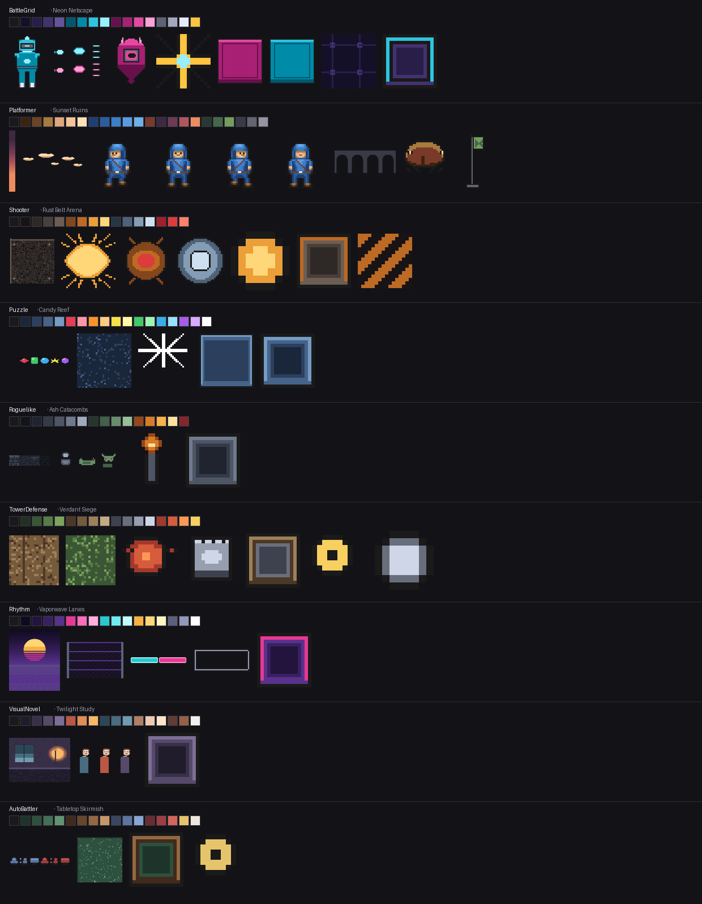

# MonoGame.GameFramework

A reusable MonoGame DesktopGL framework library with **nine sample games across nine genres** that exercise and validate it. Uses Microsoft.Extensions.DependencyInjection for wiring services. All nine ship pixel art from a gated, per-game palette pipeline — see [Pixel art](#pixel-art). See [`FINDINGS.md`](./FINDINGS.md) for the 9-game library review that drove the current shape.

## Setting Up Mac Environment

- Install both x64 and ARM .NET SDKs (not optional)
- Follow the official MonoGame setup closely, including the VS Code extensions: <https://docs.monogame.net/articles/getting_started/1_setting_up_your_development_environment_unix.html>
- `brew install freetype freeimage`
- Symlink shims so the native libs resolve at runtime:
  ```bash
  # freetype — first try
  sudo ln -s /opt/homebrew/lib/libfreetype6.dylib /usr/local/lib/libfreetype6
  # or if that path is missing (older formula)
  sudo ln -s /opt/homebrew/Cellar/freetype/2.13.2/lib/libfreetype.6.dylib /usr/local/lib/libfreetype6

  # freeimage
  sudo ln -s /opt/homebrew/Cellar/freeimage/3.18.0/lib/libfreeimage.dylib /usr/local/lib/libfreeimage
  ```
- Open a content pipeline file: `dotnet mgcb-editor ./src/MonoGame.GameFramework.BattleGrid/Content/Content.mgcb`
- Launch any sample via `dotnet run --project src/<project>/<project>.csproj` (see list below)

## Project Structure

```
Game.sln
src/
  MonoGame.GameFramework/               ← Class library (reusable framework)
  MonoGame.GameFramework.BattleGrid/    ← Grid-based duel (Mega Man Battle Network-style)
  MonoGame.GameFramework.Platformer/    ← Side-scrolling platformer
  MonoGame.GameFramework.Shooter/       ← Twin-stick arena survival
  MonoGame.GameFramework.Puzzle/        ← Match-3 gem board
  MonoGame.GameFramework.Roguelike/     ← Turn-based dungeon crawler
  MonoGame.GameFramework.TowerDefense/  ← Wave-based tower defense
  MonoGame.GameFramework.Rhythm/        ← 4-lane rhythm game
  MonoGame.GameFramework.VisualNovel/   ← Dialogue-tree VN with save/load
  MonoGame.GameFramework.AutoBattler/   ← Auto-chess shop + combat loop
  MonoGame.GameFramework.Tests/         ← 498 xUnit tests
```

## Library (`MonoGame.GameFramework`)

Services are registered via `Core/ServiceCollectionExtensions.AddGameFrameworkManagers()` and resolved via DI.

| Folder | Contents |
|---|---|
| `Audio/` | `SoundManager` |
| `Content/` | `AssetCatalog` |
| `Core/` | `ServiceCollectionExtensions` |
| `Debugging/` | `ILogger`, `ConsoleLogger`, `DebugOverlay` (tilde-toggled overlay; pause + step-frame) |
| `Events/` | `EventManager` (string API + typed `Subscribe<T>`/`Publish<T>`), `GameEventArgs` |
| `Input/` | `KeyboardManager`, `MouseManager`, `GamePadManager` |
| `Lifecycle/` | `GameState` + `GameStateManager`, `GameScene` + `SceneManager`, `TitleScreenState` |
| `Persistence/` | `SaveSystem`, `SaveFile<T>`, `SettingsManager` |
| `Pooling/` | `ObjectPool<T>`, `PooledEntitySet<T>` |
| `Rendering/` | `DrawManager`, `SpriteSheet`, `Camera2D`, `TileMap`, `TileLayer<T>`, `Primitives`, `PixelDraw`, `NineSlice`, `GridMath` |
| `Testing/` | `SmokeHarness` (for `--exit-after N` headless smoke testing) |
| `Text/` | `TextManager` (handle-based), `TextElement`, `TextHandle` |
| `Timing/` | `TimerManager` (`After`/`Every`/`Over`) |
| `Tween/` | `Tween<T>` + `Tween.Float/Vec2/Color` factories, `Easing` (namespace: `MonoGame.GameFramework.Tweening`) |
| `UI/` | `UIManager` (hit-testing, focus, click handlers), `HpBar`, `LogBox` |

For detailed usage notes (text-rendering rules, lifecycle hooks, pooling patterns, etc.), see [`CLAUDE.md`](./CLAUDE.md).

## Sample games

Each is playable end-to-end. Run any with:

```bash
dotnet run --project src/MonoGame.GameFramework.BattleGrid/MonoGame.GameFramework.BattleGrid.csproj
```

| Sample | Genre | What it validates |
|---|---|---|
| `BattleGrid` | Real-time grid duel | `EventManager` (string API), `TextManager`, `GameStateManager` with inline-mode overlay |
| `Platformer` | Side-scroller | `Camera2D` with follow-lerp + snap-on-respawn, AABB collision, coyote time, jump buffer |
| `Shooter` | Twin-stick arena | `PooledEntitySet<Projectile>` + `<Enemy>`, `TimerManager.Every` for spawn waves, `Camera2D.ScreenToWorld` |
| `Puzzle` | Match-3 | `TileMap` + `TileLayer<Gem>`, `TileLayer.Swap`, `TileMap.TryWorldToCell` |
| `Roguelike` | Dungeon crawler | Procedural `TileLayer<TileKind>` generation, bump-to-attack, `UI.LogBox` combat log |
| `TowerDefense` | Wave defense | `GridMath.TryMouseToCell`, `PooledEntitySet<T>` with per-reason `onCull`, `TimerManager.Every` |
| `Rhythm` | 4-lane rhythm | `Audio.SoundManager` (click SFX), per-lane flash timers |
| `VisualNovel` | Dialogue tree | `SaveSystem` save/load, `Tween.Float` with `Easing.QuadOut` for char-by-char text reveal |
| `AutoBattler` | Auto-chess | `EventManager.Subscribe<T>`/`Publish<T>` typed API, multi-state graph (Title→Shop→Combat→PostCombat) |

All 9 title screens inherit from `Lifecycle.TitleScreenState` (override `BackgroundColor`, `TitleText`, `GetButtons()` — ~30 lines each vs. ~100 hand-rolled). All 9 also skin it: a `NineSlice` button frame, a tiled background, and a `DrawBackdrop` hook each game paints its own cast into. Every part of the skin is opt-in — a screen that overrides none of it renders exactly as it did before the skin existed, which is what made it safe to change a base class with nine live consumers.

## Pixel art

All nine samples ship pixel art: a per-game palette, `.pix` sources with their PNG exports under `Content/sprites/`, and a nine-slice-skinned title screen. `Rendering.Primitives` survives for the handful of things that are genuinely rectangles — HP bars, selection rings, scrims, the odd divider.



**One palette per game.** Thirteen colours could not carry nine art directions, which is the whole reason for the split: nine games built on one library are supposed to look like nine games. The only thing every palette shares is `outline` `#1A1A1A`, enforced by `check-palettes`. Hue, ramp count and UI chrome are each game's own call — that is exactly the axis the samples exist to differ on.

| Game | Direction | The idea |
|---|---|---|
| `BattleGrid` | *Neon Netscape* | Cyan is yours, magenta is the intruder's, and nothing else on screen is either |
| `Platformer` | *Sunset Ruins* | Dithered dusk sky, parallax clouds, a silhouetted aqueduct; a strict superset of `assets/palette.gpl`, so the committed hero never moved |
| `Shooter` | *Rust Belt Arena* | Radially symmetric walker and drone differing only in hue, because a sprite that never rotates must read from every angle |
| `Puzzle` | *Candy Reef* | Six gems that differ in silhouette as well as hue, so the board stays playable without colour vision |
| `Roguelike` | *Ash Catacombs* | No hue at all in the architecture; monsters get the one hue the walls never use |
| `TowerDefense` | *Verdant Siege* | Turf vs. rutted road answers "can I build here?" by hue, so the grid needs no gridlines |
| `Rhythm` | *Vaporwave Lanes* | Lane floors drawn as a Bayer dither, so the backdrop reads *through* the board |
| `VisualNovel` | *Twilight Study* | One room lit from two directions, and the only skin ramp in the repo — portraits are a VN's entire visual budget |
| `AutoBattler` | *Tabletop Skirmish* | Three classes separated by silhouette, because at 48px and moving that is all that survives |

### The pipeline

```
  1. GENERATE   any front-end — a .pix text grid, Aseprite by hand, PixelLab,
                Retro Diffusion, a traced concept image. Unconstrained.
  2. CONFORM    mgf-tools conform-sprite ...   (mechanical and deterministic;
                a .pix skips this — it cannot be off-palette)
  3. GATE       mgf-tools check-palette-all + check-palettes + check-pix-all
                (all three run in CI)
```

Step 3 is what makes step 1 safe to change: adopting a new art tool stops being a bet on discipline, because the worst case is a red build.

**The `.pix` format** is where most art in this repo lives — a key mapping single characters to palette entry names, then a grid of those characters. It exists for three properties: `git diff` shows *which pixels* changed, every pixel names a palette entry so it cannot be off-palette, and `.` is the only transparency so alpha is binary by construction. `render-pix-all` renders them to the PNGs the content pipeline eats; `check-pix-all` fails the build if a committed PNG and its `.pix` ever disagree. It does not replace Aseprite — hand-polish and anything much above 64x64 still want a real editor.

Consistency only half-decomposes into rules a machine can check. Palette, binary alpha, texture format, padding and sampler state are mechanical. Light direction, proportion and outline convention are judgment calls that live in [`STYLE.md`](./assets/STYLE.md) and nowhere else — don't expect the linters to catch a sprite that's simply lit from the wrong side.


## Build, test, run

```bash
dotnet build Game.sln                          # Build all projects
dotnet test  Game.sln                          # Run the 498 library + tools tests
dotnet restore                                 # Restore NuGet packages
scripts/smoke-all.sh                           # Launch each of the 9 samples for 120 frames, fail on crash
                                               # Needs a GUI session — see note below
scripts/new-sample.sh <Name>                   # Scaffold a new sample (copies template/, wires into Game.sln)
dotnet run --project src/MonoGame.GameFramework.Tools -- lint-all-samples
                                               # Check every sample's source against its spritefont charset
dotnet run --project src/MonoGame.GameFramework.Tools -- check-content-cache-all
                                               # Flag .spritefont sources newer than their compiled .xnb
dotnet run --project src/MonoGame.GameFramework.Tools -- check-versions
                                               # Diff TargetFramework / package versions across csprojs
dotnet run --project src/MonoGame.GameFramework.Tools -- check-boot-all
                                               # Verify each Game1.cs wires up the boot conventions
dotnet run --project src/MonoGame.GameFramework.Tools -- check-sprites-all
                                               # Pixel-art conventions (texture format, padding, PointClamp)
dotnet run --project src/MonoGame.GameFramework.Tools -- check-palette-all
                                               # Every sprite uses only its nearest palette, with binary alpha
dotnet run --project src/MonoGame.GameFramework.Tools -- check-palettes
                                               # The palettes as a family: shared outline spine, no ramp collisions
dotnet run --project src/MonoGame.GameFramework.Tools -- check-pix-all
                                               # Committed PNGs still match the .pix they were rendered from
dotnet run --project src/MonoGame.GameFramework.Tools -- render-pix-all
                                               # Re-render every .pix source to its PNG
dotnet run --project src/MonoGame.GameFramework.Tools -- conform-sprite --input <png> --output <png>
                                               # Map arbitrary art onto the palette (Oklab nearest, binary alpha)
```

Everything from `lint-all-samples` down runs in CI, except `check-content-cache-all` — it compares `.spritefont` mtimes against compiled `.xnb` artifacts, and a fresh checkout has no `Content/bin`, so it would skip every sample and report a meaningless pass. It stays a local pre-run guard.

**`smoke-all.sh` must be run from a real GUI session** (a Terminal window you're logged into), not over SSH or from a background/agent shell. The samples are DesktopGL, so each one opens an SDL window; without a window server to composite it the process blocks in `Cocoa_GL_SwapWindow` waiting on a vsync that never arrives. The failure is silent and unhelpful — every sample times out with `rc=142` and an empty log, which looks exactly like a mass crash but isn't. The same constraint is why smoke isn't in CI: a headless runner would need a virtual display (xvfb).

## Tests (`MonoGame.GameFramework.Tests`)

498 xUnit tests with FluentAssertions covering pure-logic pieces: `ObjectPool` (including the debug double-return guard), `PooledEntitySet`, `TimerManager`, `Tween`/`Easing`, `TileMap`/`TileLayer` (including `Swap`, `TryWorldToCell`, and negative-coordinate flooring), `GridMath`, `EventManager` (string + typed + `AnyEvent` hook + subscriber bookkeeping), `SaveSystem` (round-trip, atomic write, and every corrupt-file path), `SettingsManager`, `Camera2D` including frame-rate-independent follow and whole-pixel view snapping, `ScreenScaler.Fit`/`WindowToVirtual` integer-scale letterboxing and window-to-design mapping, `SoundManager` volume mixing and clamping, `TitleScreenState` menu traversal (`NextEnabledIndex` wrap/skip plus driven activation), `GameStateManager` lifecycle + `StackDepth`, the full stacking path in `GameStateStackTests` (paint order, `IsActive`/`IsVisible`, `Obscuring`/`Revealed`, same-frame pop), `NineSlice.SliceRects` geometry, `TextManager`, `SceneManager`, `AddGameFrameworkManagers` container wiring, `UIManager` + `ElementCount` + cross-group z-order, `SpriteSheet.Tint`, `TitleScreenState` registration/lifecycle, `HpBar` fill-width math, `LogBox` queue/trim, `DebugOverlay` state machine + watches + event tail + FPS rolling average, `SmokeHarness` arg parsing + frame counter, `PixelDraw.TileRects` clipping and scroll-offset arithmetic, and all ten `mgf-tools` units (`SpritefontLinter` range parsing + character coverage, `BootChecker` per-convention detection, `ContentCacheChecker` stale-artifact comparison, `VersionChecker` TFM/package drift, `SpriteConventionChecker` mgcb texture-format/padding parsing + bare-`Begin()` detection in both game and shared-library projects, `Palette` `.gpl` parsing + Oklab distance + ramp-collision detection, `PaletteChecker` per-sprite conformance, `PaletteRegistry` cross-palette family rules, `PixDocument`/`PixRenderer` parse + render + round-trip, `SpriteConformer` nearest-colour mapping + resampling). Rendering-dependent code (SpriteBatch/SpriteFont/GraphicsDevice) is smoke-tested via the nine sample games, automated by `scripts/smoke-all.sh` — which now also runs in CI under `xvfb`. Where draw *order* or draw *geometry* could be separated from draw *execution* it has been, so `GameStateManager.Draw` and `NineSlice` are asserted directly rather than eyeballed.

## History & design rationale

- [`FINDINGS.md`](./FINDINGS.md) — 9-game library review. Tracks every observation that shaped the current API surface: what was kept (validated by real consumers), what was deleted (zero consumers across all 9 games), and what was extracted (duplicated across 3+ games). Includes the §8 "Suggested Execution Order" — a 6-commit cleanup that has been executed end-to-end.
- [`CLAUDE.md`](./CLAUDE.md) — guidance for AI agents working in this repo. Usage notes for every library helper, CLAUDE convention for text rendering, lifecycle, pooling, etc.
- [`assets/STYLE.md`](./assets/STYLE.md) — the pixel-art style bible. Every rule is marked ENFORCED or JUDGMENT, because a rule nobody checks is a rule that decays.
- [`assets/WORKFLOW.md`](./assets/WORKFLOW.md) — the worked example: replacing a rectangle with generated art, with a benchmark of the generators actually tested and the accept/reject thresholds for the conform report.
